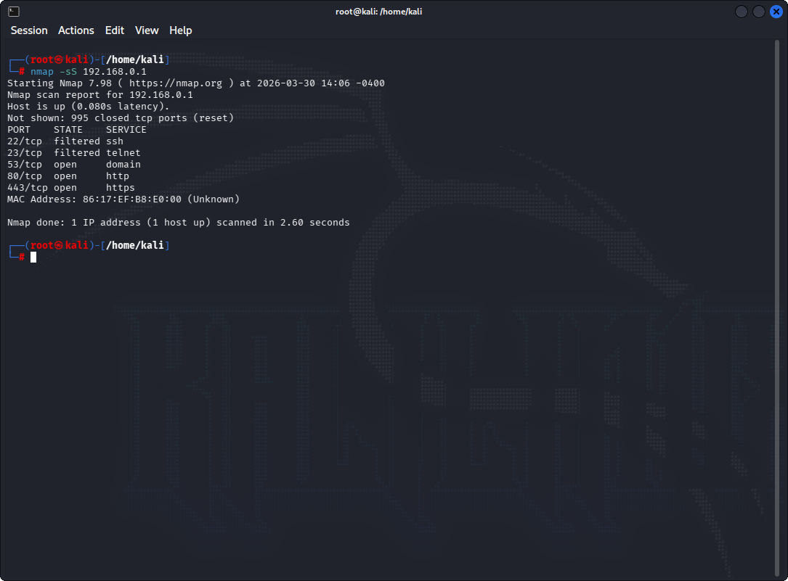
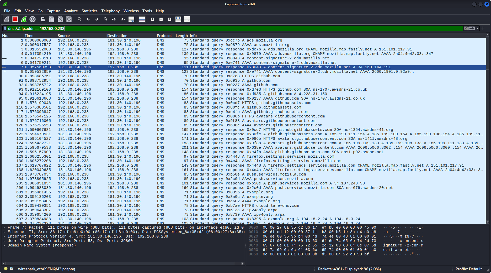

# 🔐 Network Analysis Lab (Nmap + Wireshark)

## 📌 Objective
Perform a basic network analysis to identify open ports, active services, and analyze real network traffic.

---

## 🛠 Tools Used
- Nmap
- Wireshark
- Kali Linux

---

## 🔍 Nmap Scan

Command used:
nmap -F 192.168.0.1

### Results:
- 53/tcp → open → DNS
- 80/tcp → open → HTTP
- 443/tcp → open → HTTPS
- 22/tcp → filtered → SSH
- 23/tcp → filtered → Telnet

📸 Evidence:

---

## 🌐 Wireshark Analysis

### DNS Traffic
Captured DNS query for:
api.github.com

Response:
api.github.com → 34.160.144.191

### HTTPS Traffic
Observed TCP communication with:
34.160.144.191:443

Including:
- SYN
- ACK
- FIN / RST

📸 Evidence:

---

## 🧠 Key Findings
- Identified exposed services on local network
- Observed DNS resolution process
- Analyzed encrypted HTTPS traffic
- Understood real network communication flow

---

## 🚀 Future Improvements
- Deep packet inspection
- Suspicious traffic detection
- Advanced Nmap scanning techniques

---

## 👤 Author
Tomas Brown
